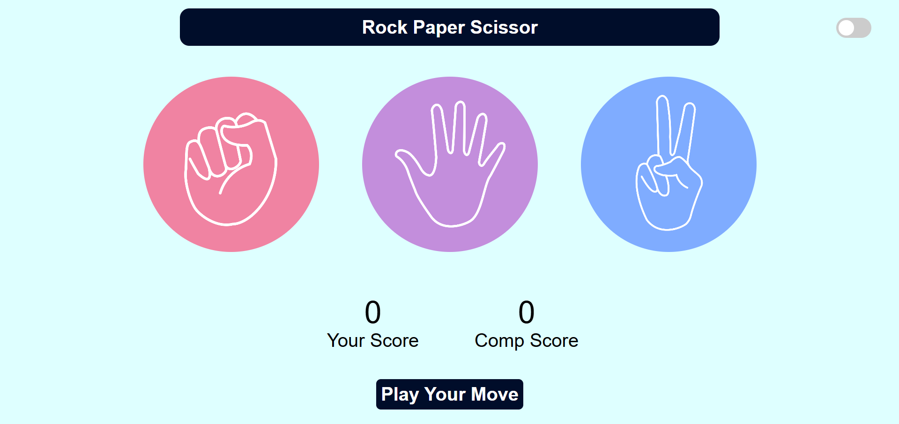
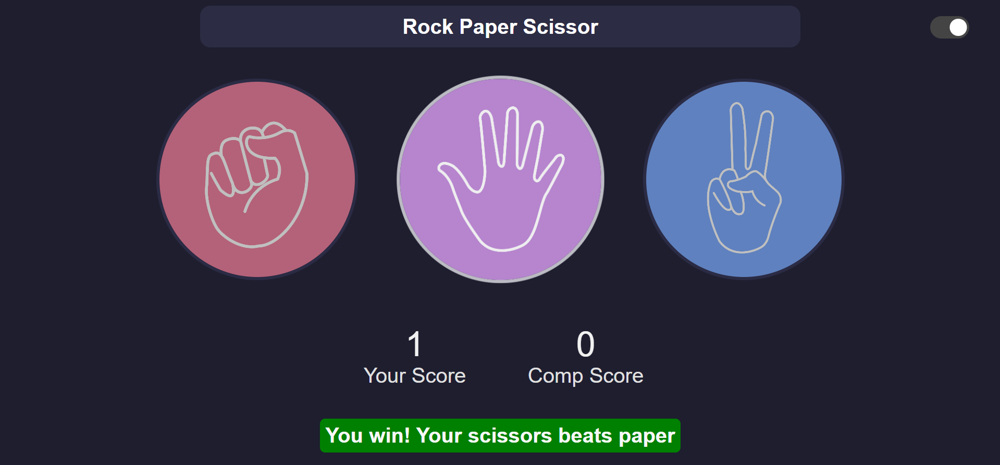

# Rock Paper Scissors Game 🎮✊✋✌️

A simple and interactive Rock Paper Scissors game built using HTML, CSS, and JavaScript. Play against the computer and test your luck and strategy!

## 🚀 Features

- Classic Rock, Paper, Scissors gameplay
- Responsive and intuitive user interface
- Real-time score tracking
- Randomized computer moves
- Visual feedback for wins, losses, and ties

## 🛠️ Technologies Used

- **HTML** – Structure of the game
- **CSS** – Styling and layout
- **JavaScript** – Game logic and interactivity

## 📸 Screenshots

## 🎮 How to Play

1. Choose Rock, Paper, or Scissors by clicking on the respective button.
2. The computer randomly selects its move.
3. The result is displayed and scores are updated.
4. Play as many rounds as you like!
